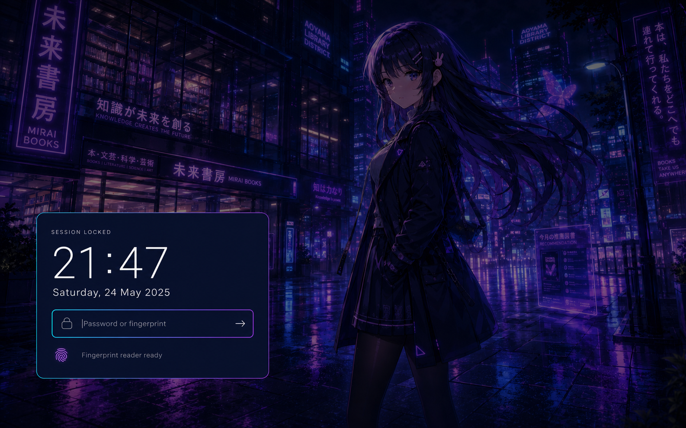
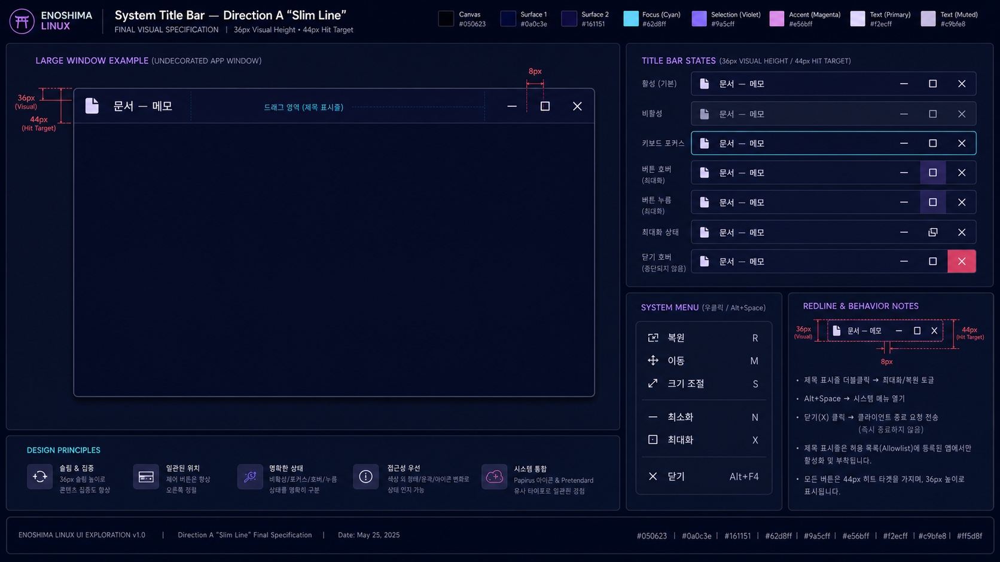
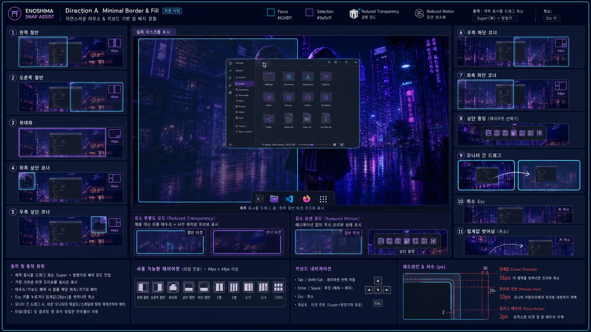
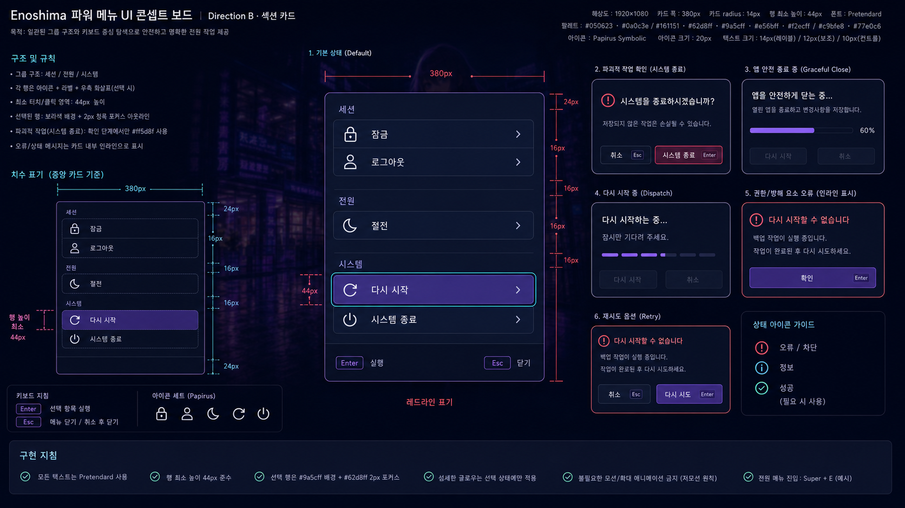
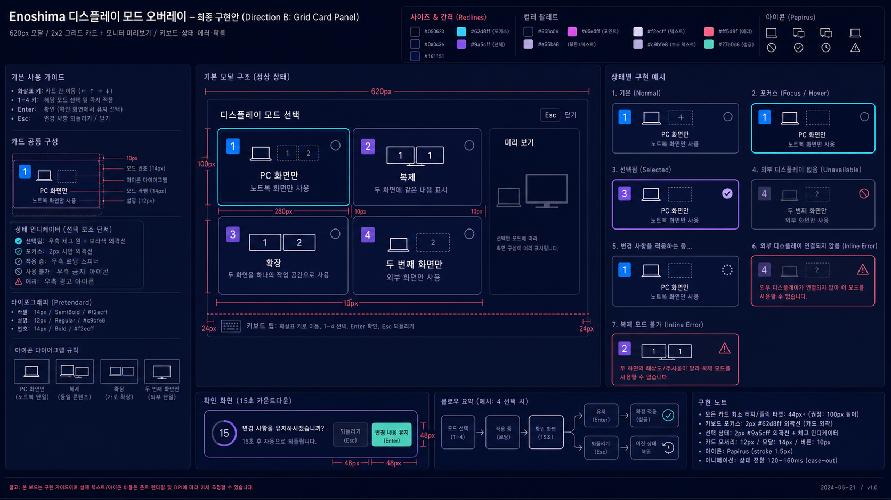
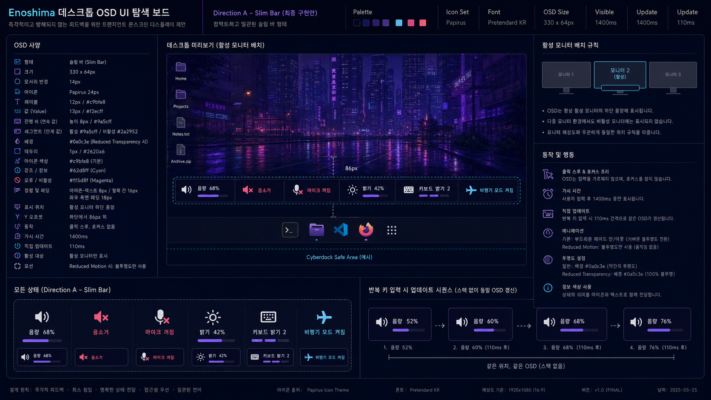
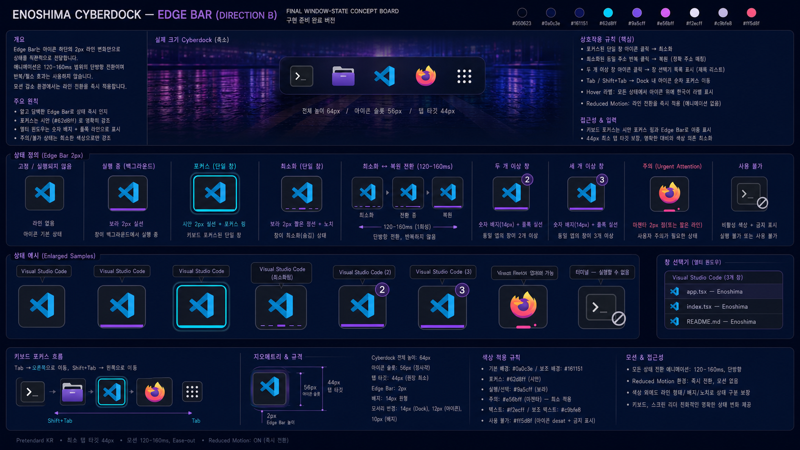
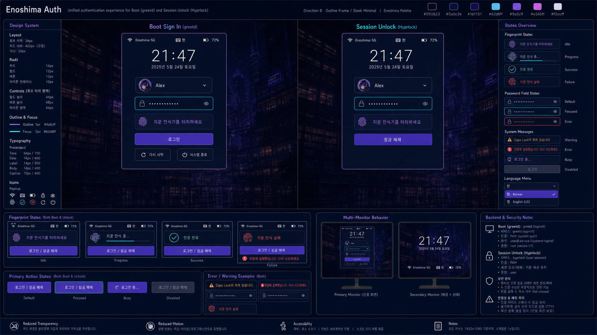

# Cyberpunk Library desktop concept

The supplied Cyberpunk Library artwork is the visual anchor for the desktop.
It is already deployed as the ratio-specific wallpapers under
`home/dot_local/share/backgrounds/`; the generated images below are interface
studies, not additional wallpapers. They translate the source artwork into
repeatable layout, color, density, and interaction rules that can be
implemented with Hyprland, Waybar, the repository-owned Quickshell
CyberLauncher/Cyberdock/CyberOSD shell, SwayNC, and Hyprlock.

## Concept studies

### Desktop shell

The shell study establishes the persistent composition: five purpose-led
workspaces, quiet status chrome, clearly separated tiled windows, a single
active-focus edge, and a compact persistent Dock. The Dock reserves a stable
bottom work area during normal use and hides only for a true fullscreen client
or while CyberLauncher owns the screen; fullscreen retains a small bottom-edge
reveal target. Persistent surfaces remain substantially opaque so that the
wallpaper never competes with text.

### Application launcher

The launcher study combines a keyboard-first Spotlight-like entry point with
the explicit result hierarchy and visible actions of Windows Search. The
search field is the initial focus, result rows meet the shared minimum target
size, and the selected result has one unambiguous cyan focus treatment.

### Notification and control center

The notification study keeps transient information on the right edge beneath
the status bar. Notifications remain grouped and actionable, while status and
do-not-disturb state are discoverable without filling the persistent bar with
secondary controls. The implemented 3-by-2 quick-settings grid provides real
Wi-Fi, Bluetooth, and Night Light toggles plus Power, Audio, and Display
actions; it does not present non-functional mock controls.

### Lock and authentication

The lock study keeps the supplied artwork recognizable behind a restrained
scrim and moves the complete authentication hierarchy into one centered
Outline Frame. Time, date, session state, the focused password field, and fingerprint
readiness follow one reading path without placing fictional controls over the
character or the library signage. The managed Hyprlock layout uses the same
placement, palette, focus edge, and biometric status model. Enoshima Auth extends
that hierarchy to initial login with user, session, and power actions on an
isolated mixed-DPI Hyprland compositor. The responsive SDDM theme preserves
the same hierarchy only as a tested rollback surface.
`home/dot_config/enoshima/auth-theme.yaml` is the shared semantic token and
geometry contract; validation rejects drift between the GTK greeter and Hyprlock.

### System title bar and window menu

The compositor-owned Slim Line title bar is a positive-allowlist fallback for
clients that provide no usable chrome. Its 36 px visual bar retains 44 px
caption-button targets, a broad modifier-free drag area, maximize/restore on
double-click, an accessible system menu, and a client-close request that never
kills the application process. Client-owned and Enoshima title bars must never
appear on the same window.

### Snap Assist

Snap Assist gives title-bar dragging and keyboard placement one shared
controller. Half, corner, maximize, layout-picker, cancellation, and
cross-monitor behavior use a restrained geometry preview. Reduced transparency
replaces translucent fill with a stronger border and hatch; reduced motion
changes preview state without a spatial sweep.

### Power, display, and transient feedback

The power menu keeps session and system actions in stable groups while exposing
graceful-close progress, login1 dispatch, and recoverable errors. The display
overlay makes its four spatial relationships visible and protects changes with
a timed keep/revert step. The Slim Bar OSD reuses a single click-through active-
monitor surface for volume, microphone, brightness, keyboard-light, and radio
feedback.

### Cyberdock window state

Cyberdock uses a quiet bottom edge bar, notch, and count badge to distinguish
pinned, running, focused, minimized, restoring, multi-window, urgent, and
unavailable states. These markers render the address-based state machine; they
must not invent state from icon clicks independently.

### Unified Enoshima Auth

Boot sign-in and session unlock keep distinct secure backends but share one
420 px visual hierarchy. The greetd front end creates a session; Hyprlock
unlocks the existing session. Password and fingerprint feedback, Caps Lock,
keyboard layout, multi-monitor policy, and fail-closed behavior are common.
Only boot mode offers login1-backed restart and shutdown.

## Shared visual language

| Role | Value | Use |
| --- | --- | --- |
| Canvas | `#050623` | wallpaper scrims, deepest backgrounds, shadows |
| Surface | `#0a0c3e` | persistent bar and control-center surfaces |
| Raised surface | `#161151` | notifications, menus, focused rows |
| Focus / information | `#62d8ff` | keyboard focus, connected state, active edge |
| Selection accent | `#9a5cff` | selected edge and non-text violet accent |
| Filled selection | `#6541b8` | active workspace, checked control, compact badge |
| On selection | `#f2ecff` | text and glyphs on filled selection |
| Expressive accent | `#e56bff` | sparse visual accent and minimized-state cue |
| Text | `#f2ecff` | primary content |
| Success | `#77e0c6` | healthy and completed state |
| Warning | `#ffb86b` | degraded but recoverable state |
| Critical | `#ff5d8f` | destructive action and critical alert |

All components use the same behavioral tokens:

- an 8 px spacing grid, with 14 px desktop edge margins;
- 10--14 px component radii and a 2 px compositor focus edge;
- at least 40 px for compact secondary controls and 44 px for primary pointer
  targets;
- near-opaque persistent chrome, with blur reserved for transient overlays;
- one focus cue per interaction, never simultaneous competing glows;
- 110--190 ms direct-manipulation transitions and no continuous pulsing;
- spatial motion stays instant on shell surfaces that cannot consume the
  reduced-motion profile dynamically;
- text plus shape or icon changes for critical state, not color alone.

## Implementation mapping

| Concept element | Managed implementation |
| --- | --- |
| Five labeled workspaces | `home/dot_config/waybar/config.jsonc` and Hyprland workspace rules |
| Active focus edge, gaps, radius, motion | `home/dot_config/hypr/hyprland.lua` |
| Two-column search, result detail, and quick apps | `home/dot_config/quickshell/cyberdock/CyberLauncher.qml` and the `cyberlauncher` layer rule |
| Status and notification entry point | Waybar notification module |
| Grouped notifications, DND, and six functional quick settings | `home/dot_config/swaync/` |
| Persistent application Dock and fullscreen reveal | `home/dot_config/quickshell/cyberdock/shell.qml` |
| Volume and brightness feedback | `home/dot_config/quickshell/cyberdock/CyberOsd.qml` and shell IPC helpers |
| Power transition feedback | `home/dot_config/quickshell/cyberdock/PowerMenu.qml` and `desktop-power` |
| Display mode choice and rollback | `home/dot_config/quickshell/cyberdock/DisplayModeOverlay.qml` |
| Window-state markers | Cyberdock state store, event bridge, and `shell.qml` |
| System title bar and window menu | positive-allowlist Enoshima decoration backend |
| Pointer and keyboard Snap Assist | shared snap controller and `EnoshimaSnapAssist.qml` |
| GTK 3/4 application surfaces | managed `settings.ini` and semantic `gtk.css` in `home/dot_config/gtk-3.0/` and `home/dot_config/gtk-4.0/` |
| Cursor, file chooser, and input-method continuity | UWSM/Hyprland cursor exports, `home/dot_config/xdg-desktop-portal/`, and managed Fcitx5 Classic UI settings |
| Authentication hierarchy | `home/dot_config/hypr/hyprlock.conf`, `enoshima-greeter` under `packages/local/`, and the fallback SDDM theme under `ansible/roles/desktop_expansion/` |

`docs/ui-surfaces.yaml` and the per-surface specs turn approved concept art into
a structural implementation contract. A concept must not introduce controls
that the managed component cannot actually operate, duplicate application-owned
title bars, or trade legibility for glass effects. It is not a pixel golden:
the required contract covers hierarchy, tokens, geometry, controls, states,
localization, scaling, and accessibility. Visual acceptance on the real
internal and external displays remains the final manual gate. The named GTK
theme, cursor, Fcitx5 material theme, Audio panel, and Display panel also
depend on their declared Arch packages being installed through a complete
bootstrap/full upgrade; the repository does not perform a partial pacman
transaction merely to preview the theme.
Default, reduced-motion, reduced-transparency, and accessible appearance modes
must all be included in that display review.
