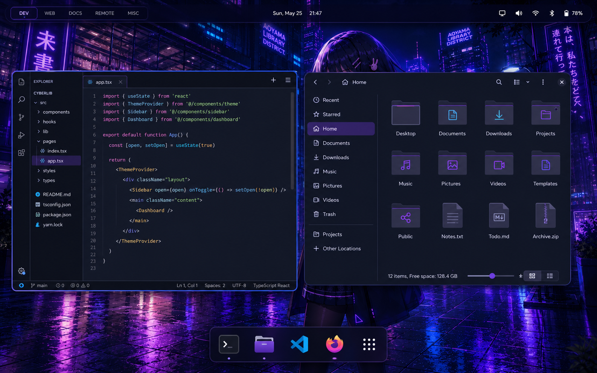
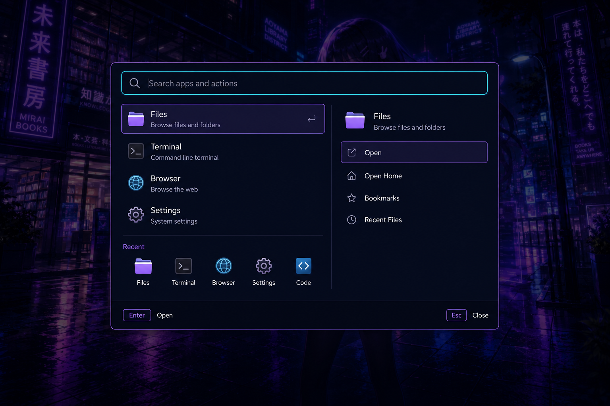
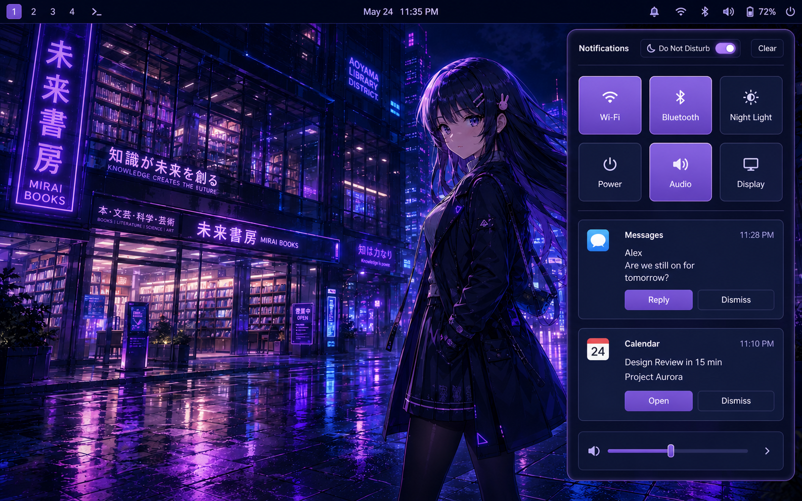

# Cyberpunk Library desktop concept

The supplied Cyberpunk Library artwork is the visual anchor for the desktop.
It is already deployed as the ratio-specific wallpapers under
`home/dot_local/share/backgrounds/`; the generated images below are interface
studies, not additional wallpapers. They translate the source artwork into
repeatable layout, color, density, and interaction rules that can be
implemented with Hyprland, Waybar, hyprlauncher, SwayNC, Quickshell, and
Hyprlock.

## Concept studies

### Desktop shell

The shell study establishes the persistent composition: five purpose-led
workspaces, quiet status chrome, clearly separated tiled windows, a single
active-focus edge, and a compact reveal-on-demand Dock. Persistent surfaces
remain substantially opaque so that the wallpaper never competes with text.

### Application launcher

The launcher study combines a keyboard-first Spotlight-like entry point with
the explicit result hierarchy and visible actions of Windows Search. The
search field is the initial focus, result rows meet the shared minimum target
size, and the selected result has one unambiguous cyan focus treatment.

### Notification and control center

The notification study keeps transient information on the right edge beneath
the status bar. Notifications remain grouped and actionable, while status and
do-not-disturb state are discoverable without filling the persistent bar with
secondary controls. The current implementation keeps the control surface
within SwayNC's supported widget set rather than presenting non-functional
mock controls.

## Shared visual language

| Role | Value | Use |
| --- | --- | --- |
| Canvas | `#050623` | wallpaper scrims, deepest backgrounds, shadows |
| Surface | `#0a0c3e` | persistent bar and control-center surfaces |
| Raised surface | `#161151` | notifications, menus, focused rows |
| Focus / information | `#62d8ff` | keyboard focus, connected state, active edge |
| Selection | `#9a5cff` | active workspace, selected control |
| Expressive accent | `#e56bff` | sparse visual accent and unread badge |
| Text | `#f2ecff` | primary content |
| Success | `#77e0c6` | healthy and completed state |
| Warning | `#ffb86b` | degraded but recoverable state |
| Critical | `#ff5d8f` | destructive action and critical alert |

All components use the same behavioral tokens:

- an 8 px spacing grid, with 14 px desktop edge margins;
- 10--14 px component radii and a 2 px compositor focus edge;
- at least 40 px for interactive rows and icon targets;
- near-opaque persistent chrome, with blur reserved for transient overlays;
- one focus cue per interaction, never simultaneous competing glows;
- 110--190 ms direct-manipulation transitions and no continuous pulsing;
- text plus shape or icon changes for critical state, not color alone.

## Implementation mapping

| Concept element | Managed implementation |
| --- | --- |
| Five labeled workspaces | `home/dot_config/waybar/config.jsonc` and Hyprland workspace rules |
| Active focus edge, gaps, radius, motion | `home/dot_config/hypr/hyprland.lua` |
| Search surface | `home/dot_config/hypr/hyprlauncher.conf` and its Hyprland layer rule |
| Status and notification entry point | Waybar notification module |
| Grouped notifications and DND | `home/dot_config/swaync/` |
| Reveal-on-demand application Dock | `home/dot_config/quickshell/cyberdock/shell.qml` |
| Authentication hierarchy | `home/dot_config/hypr/hyprlock.conf` |

Concept art is deliberately advisory. It must not introduce controls that the
managed component cannot actually operate, duplicate application-owned title
bars, or trade legibility for glass effects. Visual acceptance on the real
internal and external displays remains the final manual gate.
